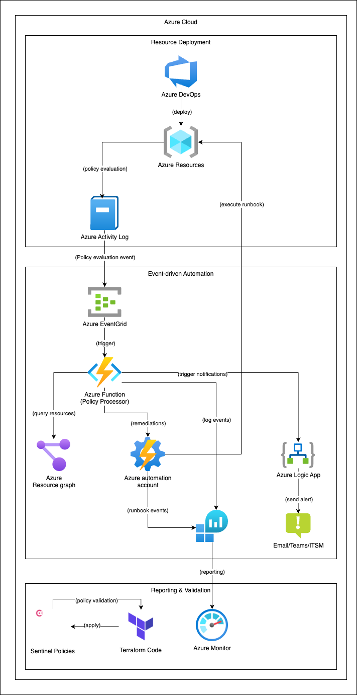
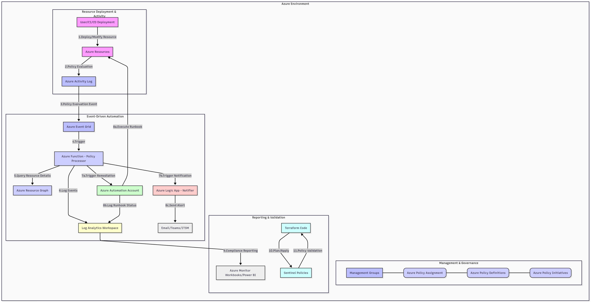

# Azure Governance Guardian: Real-time Policy Enforcement & Automated Remediation at Scale

## Table of Contents

* [Introduction](#1-introduction)
* [The Problem I am Solving](#2-the-problem-i-am-solving)
* [Proposed Solution: Azure Governance Guardian](#3-proposed-solution-azure-governance-guardian)
* [Why This Approach is the Best](#4-why-this-approach-is-the-best)
* [Technical Deep Dive](#5-technical-deep-dive)
* [Architecture Diagram](#6-architecture-diagram)
* [Deployment and Configuration Guide](#7-deployment-and-configuration-guide)
    * [Prerequisites](#prerequisites)
    * [Manual Deployment](#manual-deployment)
        * [Step 1: Clone the Repository](#step-1-clone-the-repository)
        * [Step 2: Configure Terraform Variables](#step-2-configure-terraform-variables)
        * [Step 3: Deploy Infrastructure with Terraform](#step-3-deploy-infrastructure-with-terraform)
        * [Step 4: Deploy Azure Function Code](#step-4-deploy-azure-function-code)
        * [Step 5: Configure Logic App Connections](#step-5-configure-logic-app-connections)
        * [Step 6: Verify RBAC for Managed Identities](#step-6-verify-rbac-for-managed-identities)
* [Maintenance and Evolution](#8-maintenance-and-evolution)
* [Cleanup](#9-cleanup)

## 1. Introduction

Welcome to the **Azure Governance Guardian**! In today's dynamic cloud environments, maintaining control over Azure resources isn't just a "nice-to-have", it's absolutely critical for security, cost optimization, and compliance. This solution provides a robust, automated framework to ensure Azure deployments consistently adhere to the organization's governance policies, in real-time.

## 2. The Problem I am Solving

Let's be honest, managing Azure at scale can feel a bit like herding cats. As cloud footprint grows, with multiple teams and projects deploying resources, quickly run into challenges:

- **Cloud Sprawl & Inconsistency:** Resources pop up in unauthorized regions, critical tags are missed, or insecure configurations slip through. Manual audits are slow, error-prone, and simply don't scale.
- **Security Gaps:** A single misconfigured Network Security Group (NSG) rule or a storage account exposed to the public internet can open doors to significant vulnerabilities.
- **Cost Overruns:** Oversized Virtual Machines, forgotten resources, or unoptimized services can silently drain the budget.
- **Compliance Headaches:** Meeting regulatory requirements (like GDPR, HIPAA, PCI DSS) becomes a nightmare without automated enforcement and reporting.
- **Reactive Firefighting:** We often discover non-compliance after the fact, leading to urgent, disruptive fixes.

While Azure Policy is a powerful native tool for defining rules, simply auditing isn't enough. We need a way to not only detect non-compliance but also to react intelligently, whether that's preventing the deployment, automatically fixing the issue, or providing rich, actionable alerts.

## 3. Proposed Solution: Azure Governance Guardian

The Azure Governance Guardian is automated sentry, continuously watching over the Azure environment. It's an **event-driven, real-time governance framework** designed to:

1. **Enforce Policies Proactively:** Utilize Azure Policy's Deny effect to stop non-compliant deployments before they even happen (e.g., preventing resources in unauthorized regions).
2. **Detect & React to Deviations:** For Audit policies, it identifies existing non-compliant resources and triggers automated responses.
3. **Automate Remediation:** For common, safe misconfigurations (like missing tags or insecure storage settings), it can automatically fix them.
4. **Provide Enriched Alerts:** For more complex or critical non-compliance, it sends detailed notifications to relevant teams, providing all the context they need to investigate and act.
5. **Enable Comprehensive Reporting:** All compliance events are logged centrally, allowing to build dashboards and track the governance posture over time.

Think of it as a smart, automated assistant that ensures the Azure environment stays secure, cost-efficient, and compliant, without constant manual oversight.

## 4. Why This Approach is the Best

I didn't just throw services together; every component in the `Azure Governance Guardian` was chosen for its specific strengths, leading to a truly robust and scalable solution:

- **Event-Driven & Real-time:** By leveraging Azure Event Grid to react to Azure Activity Log events (including policy evaluations), we achieve near real-time detection. This means you're informed and can act fast, reducing the window of vulnerability or cost inefficiency.
- **Serverless & Scalable:** Azure Functions and Logic Apps are serverless, meaning they scale automatically with demand and only pay for what you use. No servers to manage, patch, or worry about. This makes the solution highly cost-effective for intermittent governance checks.
- **Automated Remediation:** Moving beyond just auditing, I have integrated Azure Automation runbooks to automatically fix common policy violations. This significantly reduces manual toil for the operations teams, freeing them up for more strategic work.
- **Intelligent Alerting:** The Logic Apps are designed to send rich, contextual notifications. Instead of just a generic alert, teams get details about which resource, which policy, and why it's non-compliant, accelerating investigation and resolution.
- **Centralized Visibility:** All compliance events are tunneled into Azure Log Analytics. This creates a single source of truth for the governance data, enabling powerful Kusto queries and custom dashboards for compliance reporting and trend analysis.
- **Infrastructure as Code (IaC) with Terraform:** The entire solution's infrastructure is defined in Terraform. This ensures:
    - Reproducibility: Deploy the exact same environment anywhere, anytime.
    - Version Control: Track every change to the governance infrastructure.
    - Auditability: See who changed what and when.
    - Automation: Seamlessly deploy updates through the CI/CD pipelines.
- **Pre-Deployment Validation with Sentinel:** Integrating HashiCorp Sentinel policies means, Terraform plans are automatically checked against the security and compliance standards before any resources are provisioned in Azure. This "shift-left" approach catches misconfigurations early, preventing non-compliant deployments altogether.
- **Modularity & Extensibility:** The solution is built with a modular Terraform structure, making it easy to add new policies, new remediation runbooks, or integrate with new notification channels as the governance needs evolve.

This isn't just about enforcing rules; it's about building an intelligent, automated, and observable governance platform that scales with Azure environment.

## 5. Technical Deep Dive

The Azure Governance Guardian orchestrates several key Azure services:

- **Azure Policy:** The foundational service for defining the organizational rules. We deploy custom `Policy Definitions` (e.g., "Enforce Mandatory 'Environment' Tag", "Deny Public IP on Specific Subnets") and group them into `Policy Initiatives` (Policy Sets) like "Core Governance Initiative." These are then assigned at the Management Group or Subscription level.
- **Azure Activity Log:** The source of truth for all control plane operations in Azure, including policy evaluation results.
- **Azure Event Grid:** A serverless event routing service that subscribes to specific events in the Activity Log (e.g., `Microsoft.Authorization/policyEvaluations/audit/action`). It acts as the trigger for our reactive components.
- **Azure Function (Policy Processor):** The brain of the operation. Triggered by Event Grid, this Python function:
    - Parses the incoming policy evaluation event.
    - Queries Azure Resource Graph to enrich resource details.
    - Determines the appropriate action based on the policy and compliance state (e.g., trigger remediation, send alert).
    - Logs all events to Log Analytics for reporting.
    - Uses a System-Assigned Managed Identity for secure, credential-less access to other Azure services.
- **Azure Automation Account:** Hosts PowerShell and Python `Runbooks` that perform automated remediation actions (e.g., `remediate-missing-tags.ps1`, `fix-public-ip-config.py`, `enforce-storage-https-only.ps1`). It also uses a System-Assigned Managed Identity for its permissions.
- **Azure Logic Apps:** Used for flexible and rich notifications. Triggered by the Azure Function, they can integrate with various services like Office 365 Outlook (for email), Microsoft Teams, ServiceNow, Jira, etc., sending detailed, contextual alerts.
- **Azure Log Analytics Workspace:** A centralized logging solution that collects all compliance events from the Azure Function. This data forms the basis for compliance reporting and trend analysis using Kusto Query Language (KQL) and Azure Monitor Workbooks.
- **Terraform:** The Infrastructure as Code (IaC) tool used to define, deploy, and manage all the Azure resources for this solution in a modular and repeatable way.
- **Sentinel:** HashiCorp's policy-as-code framework used to validate Terraform plans against predefined security and compliance rules before deployment, ensuring that IaC itself is compliant.

## 6. Architecture Diagram



The following diagram illustrates the flow of events and the interaction between the different Azure services in the Azure Governance Guardian solution:



## 7. Deployment and Configuration Guide

This guide provides step-by-step instructions to deploy and configure the Azure Governance Guardian solution in your Azure account using Terraform.

### Prerequisites

- **Azure Subscription:** An active Azure subscription with permissions to create all necessary resources (Resource Groups, Storage Accounts, App Service Plans, Function Apps, Automation Accounts, Log Analytics Workspaces, Logic Apps, Event Grid Subscriptions, IAM Roles/Assignments, Azure Policy Definitions/Assignments).
- **Terraform:** Install Terraform
- **Azure CLI:** Install and configure Azure CLI with credentials for the target subscription. Ensure you are logged into the correct subscription (`az login` and `az account set --subscription <subscription-id>`).
- **Git:** Install Git to clone the repository.
- **Python:** Python 3.9+ installed locally for testing the Azure Function.
- **PowerShell (Optional):** PowerShell Core (pwsh) for testing PowerShell runbooks locally.
- **VNet Integration Subnet:** If you plan to integrate the Azure Function into a VNet (highly recommended for production), you'll need an existing subnet. This subnet must be delegated to Microsoft.Web/serverFarms.
- **Logic App API Connections:** For the Logic App to send emails (Office 365 Outlook) or Teams messages, you'll need to manually authorize these API connections in the Azure Portal after the Logic App is deployed.

### Manual Deployment

#### Step 1: Clone the Repository

Start by cloning this Git repository to your local machine:
```bash
git clone https://github.com/chathushka-dilhan/azure-governance-guardian.git
cd azure-governance-guardian
```

#### Step 2: Configure Terraform Variables

Navigate to the `terraform/` directory. You'll need to provide values for the variables defined in `variables.tf`. The easiest way is to create a `terraform.tfvars` file in the `terraform/` directory:

```bash
cd terraform/
touch terraform.tfvars
```

Edit `terraform.tfvars` with the specific values. Replace the placeholder values with the actual Azure environment details.

```terraform
# terraform/terraform.tfvars

# General Project Settings
project_name = "azgovguardian" # Keep this consistent with the default, or change if desired
location     = "East US 2"      # <--- DESIRED AZURE REGION (e.g., "West US 2", "North Europe")
common_resource_group_name = "rg-azgovguardian-common"

# Management Group for Policy Assignment (Optional, but recommended for scale)
# If left empty, policies will be assigned at the subscription level.
# Example: management_group_id = "/providers/Microsoft.Management/managementGroups/management-group-id"
management_group_id = ""

# Azure Function Settings
function_storage_account_name = "stazgovguardianfunc01" # <--- MUST BE GLOBALLY UNIQUE, will append random suffix
function_app_service_plan_name = "asp-azgovguardian"
function_app_name     = "func-azgovguardian-processor"
# VNet Integration (Highly Recommended for production)
# Example: function_vnet_integration_subnet_id = "/subscriptions/SUBSCRIPTION_ID/resourceGroups/VNET_RG/providers/Microsoft.Network/virtualNetworks/VNET_NAME/subnets/DELEGATED_SUBNET_NAME"
function_vnet_integration_subnet_id = ""

# Automation Account Settings
automation_account_name = "auto-azgovguardian"

# Monitoring & Alerting Settings
log_analytics_workspace_name = "log-azgovguardian"
log_analytics_retention_days = 90
logic_app_name      = "logic-azgovguardian-notifier"
notification_email  = "email@example.com" # <--- EMAIL ADDRESS FOR ALERTS

# Automation Account details for Function App environment variables (must match actual names)
automation_account_resource_group_name = "rg-azgovguardian-common"
automation_account_name = "auto-azgovguardian"
```

#### Step 3: Deploy Infrastructure with Terraform

From the `terraform/` directory, run the following commands:

1. Initialize Terraform:

    ```bash
    terraform init
    ```

2. Plan the deployment: Review the resources Terraform will create.
    ```bash
    terraform plan
    ```

3. Apply the changes: If the plan looks correct, proceed with the deployment.

    ```bash
    terraform apply
    ```

    Type `yes` when prompted to confirm.

This step will provision all the Azure resources (Resource Groups, Storage Accounts, Function App infrastructure, Automation Account, Log Analytics, Logic App, Event Grid subscription, IAM roles, and Azure Policy definitions/initiatives/assignments).

#### Step 4: Deploy Azure Function Code

The Terraform in Step 3 provisions the Azure Function App infrastructure, but it does not deploy the Python code. For production, a CI/CD pipeline (e.g., Azure DevOps, GitHub Actions) is highly recommended for this.

For testing, you can manually deploy the code:

1. Zip the Function App code:

    Navigate to the `src/functions/policy-processor/` directory:

    ```bash
    cd ../../src/functions/policy-processor/
    zip -r policy-processor.zip .
    ```

2. Deploy using Azure CLI:

    Navigate back to the `terraform/` directory.

    ```bash
    cd ../../terraform/

    # Get the Function App name from Terraform output (or variable)
    FUNCTION_APP_NAME=$(terraform output -raw function_app_name)
    RESOURCE_GROUP_NAME=$(terraform output -raw common_resource_group_name)

    az functionapp deployment zip --resource-group $RESOURCE_GROUP_NAME --name $FUNCTION_APP_NAME --src ../src/functions/policy-processor/policy-processor.zip
    ```

    Alternatively, you can upload `policy-processor.zip` via the Azure Portal under the Function App's "Deployment Center" or "Zip Deploy" options.

#### Step 5: Configure Logic App Connections

For the Logic App to send emails or Teams messages, you need to authorize its API connections in the Azure Portal:

1. Go to the Azure Portal and search for the Logic App (e.g., `logic-azgovguardian-notifier`).
2. In the Logic App menu, navigate to "API connections".
3. You will see connections listed (e.g., office365). Click on each connection that shows an "Error" or "Needs authorization."
4. Click "Authorize" and follow the prompts to sign in with an account that has permissions to send emails/messages.
5. For the Teams action, you'll need to create and authorize a Teams connection as well.

#### Step 6: Verify RBAC for Managed Identities

Ensure the Managed Identities for the Azure Function App and Automation Account have the correct permissions:

1. Azure Function App (`func-azgovguardian-processor`):

    - Reader role on the subscription (or relevant management groups/resource groups) to query resources via Azure Resource Graph.
    - Resource Policy Contributor role on the subscription (or relevant management groups/resource groups) to query policy states.
    - Automation Operator role on the Automation Account (`auto-azgovguardian`) to start runbook jobs.

2. Azure Automation Account (`auto-azgovguardian`):

    - Contributor role on the subscription (or specific resource groups where remediation actions will occur) to modify resources (e.g., add tags, change network configurations). For production, refine this to the least privilege necessary (e.g., `Tag Contributor`, `Network Contributor`, `Storage Account Contributor` on specific scopes).

You can verify and adjust these role assignments in the Azure Portal under "Access control (IAM)" for each resource or scope.

## 8. Maintenance and Evolution

Maintaining and evolving the Azure Governance Guardian is straightforward thanks to its modular and IaC-driven design:

- Updating Azure Policies:

    - Modify the JSON files in `policies/custom-definitions/` or `policies/initiatives/`.
    - Run `terraform plan` and `terraform apply` from the `terraform/` directory. Terraform will detect the changes and update the policy definitions/initiatives in Azure.

- Adding New Remediation Runbooks:

    - Create new PowerShell (`.ps1`) or Python (`.py`) runbook file in `src/runbooks/`.
    - Update the `runbook_paths` variable in `terraform/main.tf` (within the automation_account module call) to include the path to new runbooks.
    - Run `terraform plan` and `terraform apply`. Terraform will upload the new runbook to the Automation Account.
    - Update the `src/functions/policy-processor/__init__.py` to include logic for handling the new policy and triggering the new runbook, then redeploy the Function App code.

- Updating Azure Function Logic:

    - Modify the Python code in `src/functions/policy-processor/`.
    - Redeploy the Function App code (as described in Step 4).

- Monitoring Compliance:

    - Regularly check the Log Analytics Workspace (`log-azgovguardian`) for compliance events.
    - Build custom dashboards in Azure Monitor Workbooks or Power BI using Kusto queries to visualize compliance trends, identify top offenders, and track remediation success rates.

- Sentinel Policy Updates:

    - Modify the `.sentinel` files in the `sentinel/` directory.
    - These changes will automatically be picked up by the Terraform Cloud/Enterprise workspace, enforcing new validation rules on subsequent `terraform plan` executions.

- Logic App Notifications:

    - If you need to change notification recipients, add new channels (e.g., ServiceNow integration), or modify notification content, you can either:

        - Update the workflow_template JSON directly in `terraform/modules/monitoring-alerting/main.tf` and re-run Terraform.
        - Or, for minor changes to existing actions, you can sometimes modify the Logic App directly in the Azure Portal (though this deviates from IaC).

## 9. Cleanup

To avoid incurring unnecessary costs, remember to clean up all resources when the solution is no longer needed.

- Destroy Terraform resources:

    Navigate to the `terraform/` directory and run:

    ```bash
    terraform destroy
    ```

    Type `yes` when prompted to confirm.

This will remove all Azure resources created by the Terraform configuration.


